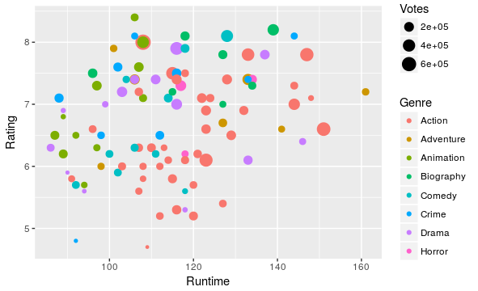

# IMDBwebScraping
This is an exercise to practise with the web scraping by means of R in particular scraping the imdb web site.

The skeleton of the code comes from: https://www.analyticsvidhya.com/blog/2017/03/beginners-guide-on-web-scraping-in-r-using-rvest-with-hands-on-knowledge/

IDEA (working in progress):

Can we apply machine learning algorithm to estimate if a movie would have success 
based on previous rating, revenue, votes, etc...

TO fix: some fields are missing (put a control and fix it)

